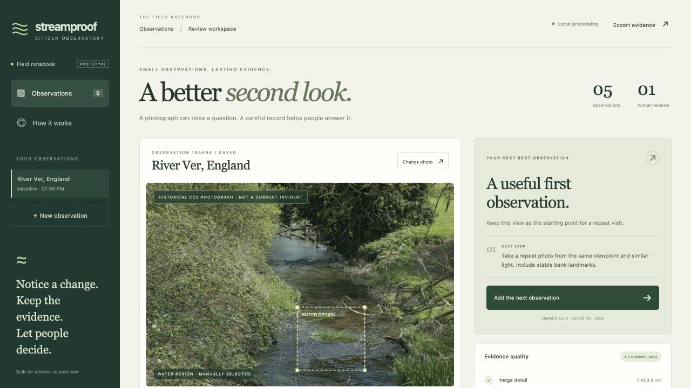

# Streamproof

**A better second look.** A citizen stream-observation notebook that turns a photograph into an inspectable record and a useful next request.

A photograph can raise a question. It cannot tell you whether water is safe. Streamproof checks whether a photo supports comparison, aligns repeat views using bank features, measures visible appearance, and lets a person decide what the evidence means. When the photo is blurred it asks for a steady retake. When lighting shifts it asks for similar light. When a local difference survives those checks it asks for a close view, an upstream view, and context.

Built from scratch on September 21, 2026. This is a working prototype with **OpenCV 5.0.0**, a Python/FastAPI processing service, persistent evidence records, and a responsive browser workspace. There is no model API, telemetry, or external inference dependency.



The recorded local walkthrough exercised five observations: a historical baseline, a programmed baseline/change pair, a lighting control and a blur control. Its exported packet passed the independent integrity verifier with six linked audit events. The example review is explicitly labeled as an AI-assisted demo operator; it is not a field assessment. Twenty-four local tests pass; hosted CI has not been verified.

## Run it

Python 3.14 was used for development. A Python 3.14 environment and the pinned requirements are recommended.

```sh
python3.14 -m venv .venv
source .venv/bin/activate
pip install -r requirements.txt
uvicorn streamproof.app:app --host 127.0.0.1 --port 8765
```

Open **http://127.0.0.1:8765**. Choose a photo, adjust and confirm its water region, then inspect it. Use a previous observation from the same site for a repeat comparison. Review the results and export the record.

The included River Ver and River Liffey photos are historical CC0 photographs with source links, authors, and hashes. They demonstrate the interface and real processing; they are **not a field validation dataset**. “Run the control case” loads a clearly labeled programmed image pair. It tests a pipeline branch, not environmental accuracy.

## What works

- JPEG/PNG upload with size, dimensions and decode checks; EXIF orientation handling; metadata-free normalized preview.
- Manual, editable water rectangle and explicit human confirmation.
- Four image-quality gates: detail, exposure clipping, bright-reflection proxy, selected area.
- Real OpenCV ORB features **outside the selected water area**, RANSAC registration, overlap gate, HSV histogram and image Lab-distance comparisons.
- Background appearance check to flag lighting confounds before interpreting a local change.
- Deterministic next-observation policy with an inspectable decision trace.
- Exact-file duplicate detection, same-site constraints, human review, source fingerprinting, and append-only hash-linked audit events.
- JSON and GeoJSON exports, including null geometry when no location was supplied.
- Optional workspace token protecting every image, observation, export and write endpoint.

## Try the evidence loop

1. Inspect the default historical River Ver photo. Its usable water region produces a baseline request.
2. Click **Run the control case**, then **Inspect this observation**. The synthetic recolored region produces a visible-change request with its measurements.
3. Toggle the actual difference overlay and inspect “Why this next step?”.
4. Add **Lighting shift control**, comparing against the synthetic baseline. The policy asks for matched light.
5. Add **Blur control**. Processing stops before comparison and requests a better photo.
6. Record a human assessment, export JSON, and independently verify its chain:

```sh
python -m scripts.verify_export streamproof-evidence.json
```

Keep an exported final hash outside the server if you need to detect later tail truncation or full database replacement. A local chain establishes consistency, not capture authenticity, capture time, verified location, or a trusted external timestamp.

## Verification

```sh
pip install -r requirements-dev.txt
python -m pytest -q
python -m scripts.evaluate_controls --output artifacts/control-evaluation.json
```

Tests exercise actual image decoding/OpenCV, HTTP multipart upload, persistence, comparison, context rejection, failed references, duplicate handling, human review, exports, tamper detection, and authentication. See [evaluation](docs/EVALUATION.md) for measured results and limits. The control generator is reproducible: `python scripts/make_fixtures.py`.

## Architecture and deployment

See [architecture](docs/ARCHITECTURE.md), [AWS deployment](deploy/AWS.md), and [submission evidence](docs/SUBMISSION.md). The Docker image runs one worker and stores SQLite, normalized images and private originals under `/data`. Mount durable storage before deployment.

| Variable | Default | Purpose |
|---|---|---|
| `STREAMPROOF_DATA` | `.data/` | Persistent SQLite and image directory |
| `STREAMPROOF_TOKEN` | empty | Shared operator token; enter in the browser when set |
| `STREAMPROOF_RUNTIME` | `local` | Honest displayed runtime label; use an AWS label only on an actual AWS runtime |

Bind localhost for local use. Before exposing a service, configure HTTPS and a workspace token. This is a single-workspace prototype, not a public multi-tenant intake platform. Raw originals remain server-side and are not included in exports. Optional location/notes and reviews **are** included in exports; inspect them before sharing. Generated demos use only bundled public or synthetic media.

## Honest boundaries

Streamproof does not estimate pH, turbidity, nutrients, organisms, pathogens, pollution source, or safety. Pixel differences are not physical environmental units. The water region is selected by a person, not a validated water segmenter. The thresholds are engineering heuristics and have not been calibrated on a paired field dataset. Camera motion, parallax, season, rain, shadows, reflections, compression and water motion can confound results. A smooth but otherwise useful water photo may fail the detail gate. Homography confidence does not prove the match is correct. A human supplies site names and capture time; these are not independently verified.

Its autonomous behavior is a deterministic evidence policy: vision outputs change the requested next action. It is not an LLM agent, has no external actuator, and does not escalate incidents or contact authorities. Community volunteers and environmental experts must validate the workflow before operational reliance.

## Licenses and attribution

Original code, interface and programmed controls: [MIT](LICENSE). Bundled historical photos: CC0-1.0; see [media provenance](docs/MEDIA.md) and `samples/*.json`. Dependencies retain their own licenses. AI-assisted coding and research were used; the implementation, measurements and failure behavior are inspectable. No current field outcome, adoption, prize, submission acceptance, or AWS deployment is claimed by this repository.
