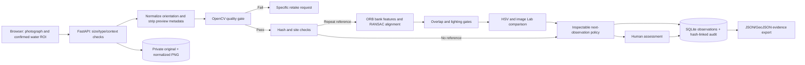

# From image to next observation

## Image tools

`vision.py` is stateless. Images are restricted to JPEG/PNG, 12 MiB, 24 megapixels and at least 64 pixels per dimension. The display/process representation is capped at 1400 pixels on its longest side and all appearance thresholds apply to that representation. SHA-256 separately records source and normalized bytes.

The confirmed rectangle is normalized to [0,1]. A 5×5 erosion excludes ROI boundaries from the detail statistic. Quality gates use Laplacian variance, grayscale clipping, HSV reflection proxy, and selected area. If any gate fails, the comparison does not run.

Reference matching uses up to 2400 ORB features outside each water ROI, Hamming nearest-neighbor ratio <0.72, at least 12 correspondences and a RANSAC homography at a 3-pixel reprojection threshold. At least 55% of matches must be inliers, and aligned water overlap must cover 65% of the current ROI. A homography is an approximation and may fail under parallax or non-planar scenes.

Appearance tools compare HSV histograms using Bhattacharyya distance and changed-pixel fraction at an image Lab-vector distance >30. These are display encoding distances, **not standard calibrated Delta-E or environmental units**. The policy requires both changed fraction >14% and histogram distance >0.15, after lighting checks. A background median distance >20 or water brightness shift >45 makes the comparison inconclusive. These thresholds are transparent heuristics, not validated sensitivity/specificity limits.

## Policy rather than a hidden score

Order: quality → exact-file duplicate → same site → reference present → alignment → lighting → appearance → human review. Each branch records the tools, observations and decisions. The browser displays the next concrete photo request. There is no learned classifier and no claim of water safety.

## Persistence and trust

Each observation records source hash, normalized hash, dimensions, ROI, all measurements, policy version, actual OpenCV version/runtime, optional user metadata, provenance and review. An immutable evidence hash is linked to a creation event. Human reviews create new events; the latest review is displayed without discarding prior review events. Events hash `previous_hash + canonical_json(event)` inside an immediate SQLite transaction.

`streamproof.integrity.verify_export` verifies chain linkage, observation hashes and the current review against the latest review event. Without an external retained checkpoint an attacker able to rewrite the database can rewrite the entire chain or remove its tail. Hashes never attest that a photo is authentic, timely, or geolocated.

Original uploaded bytes are retained in the private data directory but have no serving route. Normalized PNGs and overlays are served through protected API endpoints. Client claims that an upload is a bundled fixture are accepted only when its bytes match the local fixture hash.

## Runtime tradeoffs

The current service runs one worker. Image processing is CPU-bound and synchronous within the request; no queue, resource quotas, multi-user authorization or per-tenant isolation is implemented. SQLite is appropriate for this demonstrator's single durable volume; horizontally scaled production services would need object storage, managed database, a bounded worker queue, and access control. HTTP protection should terminate TLS before the application. Authentication is a shared operator token, not an identity system.
